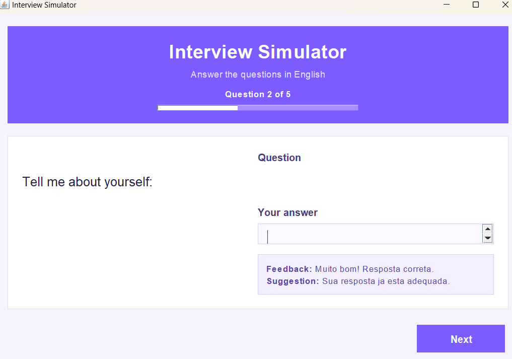
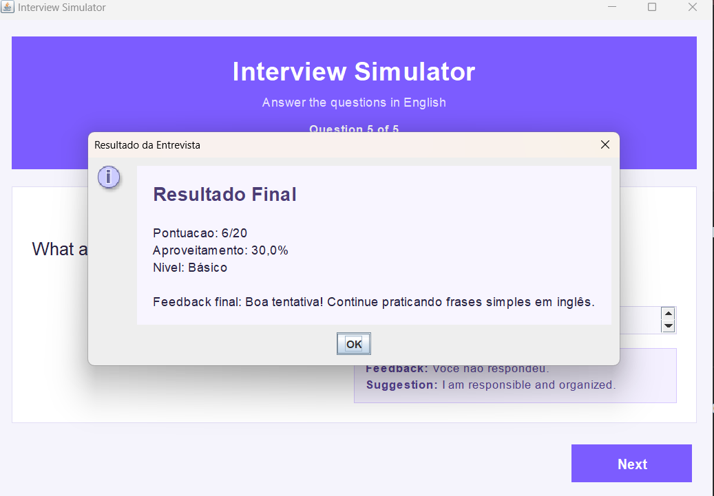

# Interview Simulator

## Overview

This project is a desktop application that simulates a job interview in English, evaluates user answers, and stores results in a MySQL database.

It was designed to help beginners practice interview scenarios while applying real-world Java concepts such as GUI development, business logic, input validation, and database integration.

This project was created as part of my learning journey in Systems Analysis and Development, with a focus on combining Java, graphical interfaces, business logic, and database integration in a practical educational solution.

## Project Highlights

- Desktop application built with Java Swing
- Interactive interview flow with 5 questions in English
- Automatic scoring and performance classification
- Feedback and suggestions after each answer
- Detection of common beginner mistakes in English
- MySQL integration to save interview history
- History screen with score, level, date, final feedback, and answers

## Main Features

### Interview simulation
- Start screen and guided interview flow
- Progress tracking during the interview
- Validation to prevent empty answers
- Final result with score, percentage, and English level

### English feedback logic
- Answer evaluation based on interview context
- Suggestions for improvement
- Special feedback for common errors such as lowercase `i` instead of `I`
- Final classification using CEFR-inspired levels:
  - `A1`
  - `A2`
  - `B1`
  - `B2`

### Database integration
- MySQL connection using JDBC
- Automatic result persistence
- Interview history listing
- Detailed attempt view with saved answers

## Technologies Used

- Java
- Java Swing
- JDBC
- MySQL
- Object-Oriented Programming

## Skills Demonstrated

- Desktop application development with Java Swing
- JDBC integration with MySQL
- Input validation and business rules
- Data persistence and history tracking
- UI organization and user flow design
- Clean separation between interface, logic, and data access layers

## Screenshots

### Start screen


### Interview screen


### Final result


## Project Structure

```text
interview-simulator-java/
|-- lib/
|   |-- mysql-connector-j-9.6.0.jar
|-- img/
|-- src/
|   |-- DatabaseConnection.java
|   |-- HistoryEntry.java
|   |-- InterfaceSimuladorStart.java
|   |-- InterviewLogic.java
|   |-- InterviewSimulator.java
|   |-- Main.java
|   |-- Result.java
|   |-- ResultDAO.java
|   |-- TestDatabaseConnection.java
|   |-- TesteConexao.java
|   `-- TestSaveResult.java
`-- README.md
```

## How to Run

### Requirements

- Java JDK installed
- MySQL installed and running
- Database `interview_simulator` created
- Table `resultados` created
- MySQL JDBC driver available in `lib/`

### Compile

```powershell
javac -cp ".;lib/mysql-connector-j-9.6.0.jar" -d out src\*.java
```

### Run the application

```powershell
java -cp ".;out;lib/mysql-connector-j-9.6.0.jar" InterfaceSimuladorStart
```

### Test database connection

```powershell
java -cp ".;out;lib/mysql-connector-j-9.6.0.jar" TestDatabaseConnection
```

## Database Notes

The application expects a MySQL database named `interview_simulator`.

Connection settings are configured in `DatabaseConnection.java`:

- URL: `jdbc:mysql://localhost:3306/interview_simulator`
- User: `root`
- Password: `root123`

The `resultados` table stores:

- candidate name
- score
- English level
- final feedback
- interview date
- saved answers

## What This Project Demonstrates

This project demonstrates my ability to:

- build Java desktop applications
- organize business logic in separate classes
- connect applications to relational databases
- create a user-friendly interface
- validate user input
- store and display historical data
- evolve a project from a simple simulator into a more complete system

## Future Improvements

- Add more interview questions
- Improve answer analysis with more grammar rules
- Export results to PDF or CSV
- Add user login/profile
- Create dashboard charts for performance evolution

## Author

**Lisanea Johanson**  
ADS Student | Java Developer in training

If you are a recruiter or hiring manager, this project represents my practical experience applying Java, Swing, SQL, and software organization in a real academic portfolio project.
